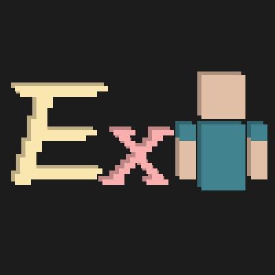

# Extra Player Renderer

Render a player entity on the bottom left corner of the screen.

在屏幕的角落渲染一个玩家实体。

This mod is released under GPL-3.0 License.

这个模组遵循 GPL-3.0 证书发布。

This mod is compatible with Gamepiaynmo's [CustomPlayerModel](https://github.com/Gamepiaynmo/CustomModel) mod, but the compatibility is not ensured if you use models smaller or larger than a normal player model.

## Configurations / 配置
Press `F8` in default

默认按下 `F8`
